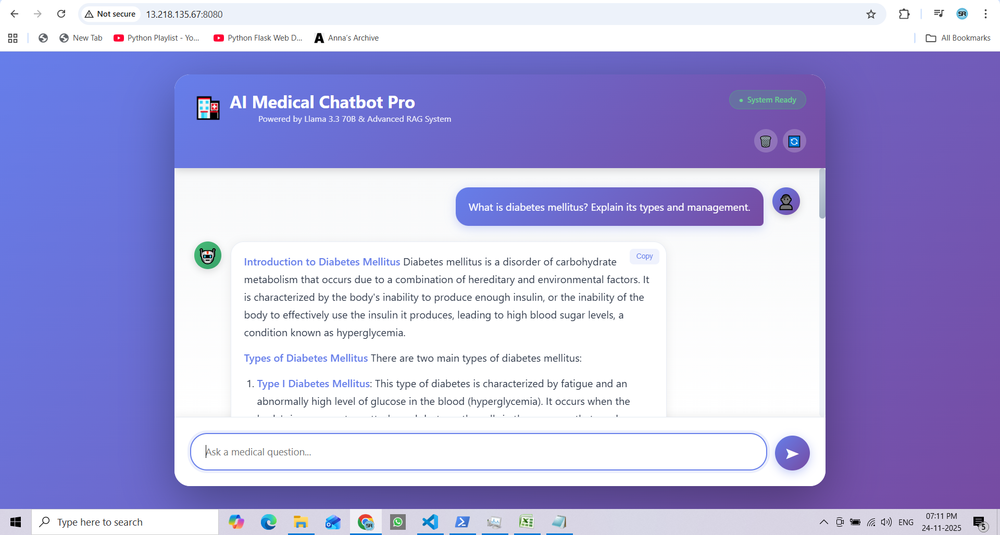

# 🏥 AI Medical Chatbot Pro — LLM + LangChain + Pinecone + Flask/Streamlit

An end-to-end **AI-powered Medical Chatbot** built using **Large Language Models (Llama 3.3 70B)**, **LangChain**, **Pinecone vector search**, and **Flask/Streamlit** — deployable on both **AWS (EC2 + ECR)** and **Render.com**.

This project covers every part:  
➡ Data ingestion & processing  
➡ Embedding + Vector DB with Pinecone  
➡ RAG-based chatbot pipeline using LangChain  
➡ REST API with Flask + Beautiful UI  
➡ Streamlit version for easy deployment  
➡ Docker containerization  
➡ Multiple deployment options (AWS EC2, Render)  
➡ Automated CI/CD with GitHub Actions

---

## ✨ Features

- 🤖 **Powered by Llama 3.3 70B** via Groq (Free API)
- 📚 **Advanced RAG System** - Retrieves relevant medical information
- 💬 **Streaming Responses** - Real-time answer generation
- 🎨 **Two UI Options** - Flask (advanced) or Streamlit (simple)
- 📱 **Responsive Design** - Works on all devices
- 🔒 **Privacy First** - No conversation storage
- 🆓 **Free to Deploy** - Multiple free hosting options

## 🎯 Live Demo

- **Render Deployment:** [Your Render URL]
- **AWS Deployment:** [Your AWS URL]

## 📸 Screenshots

### Deployment Page


### CI/CD Pipline


---

## 🚀 Quick Start - Local Development

### **STEP 01 — Clone the Repository**

```bash
git clone https://github.com/SunnyPanchani/AI-Medical-Chatbot-Pro.git
cd AI-Medical-Chatbot-Pro
```

### **STEP 02 — Create Virtual Environment**

**Using Conda:**
```bash
conda create -n medibot python=3.11 -y
conda activate medibot
```

**Or using venv:**
```bash
python -m venv env
source env/bin/activate  # On Windows: env\Scripts\activate
```

### **STEP 03 — Install Dependencies**
```bash
pip install -r requirements.txt
```

### **STEP 04 — Set Up Environment Variables**

Create a `.env` file in the root directory:

```ini
# Pinecone Vector Database
PINECONE_API_KEY=xxxxxxxxxxxxxxxxxxxxxxxxxxxxx

# Groq LLM API (FREE - get from https://console.groq.com)
GROQ_API_KEY=gsk_xxxxxxxxxxxxxxxxxxxxxxxxxxxxx
```

**Get Your Free API Keys:**
- **Pinecone:** https://www.pinecone.io/ (Free tier: 100K vectors)
- **Groq:** https://console.groq.com/ (Free tier: Very generous limits)

### **STEP 05 — Create Vector Store**

**Important:** Run this once to create your Pinecone index:

```bash
python store_index.py
```

This will:
- Load PDFs from `data/` folder
- Create embeddings
- Store vectors in Pinecone
- Create index: `medical-chatbot`

### **STEP 06 — Test the Setup**

```bash
python test_chatbot.py
```

This runs test queries to verify everything works.

### **STEP 07 — Run the Application**

**Option A: Flask Application (Advanced UI)**
```bash
python app.py
```
Then open: http://localhost:8080

**Option B: Streamlit Application (Simple UI)**
```bash
streamlit run streamlit_app.py
```
Then open: http://localhost:8501

---

## 🛠️ Tech Stack

| Component | Technology | Purpose |
|-----------|-----------|---------|
| **LLM** | Llama 3.3 70B (Groq) | Answer generation |
| **Framework** | LangChain | RAG pipeline |
| **Vector DB** | Pinecone | Semantic search |
| **Embeddings** | Sentence Transformers | Text embeddings |
| **Backend** | Flask | REST API |
| **UI** | Flask + Streamlit | User interfaces |
| **Deployment** | AWS EC2, Render | Cloud hosting |
| **CI/CD** | GitHub Actions | Automation |
| **Containerization** | Docker | Packaging |

---

## 📁 Project Structure

```
AI Medical Chatbot Pro/
├── .github/
│   └── workflows/
│       └── cicd.yaml           # CI/CD pipeline
├── .streamlit/
│   └── config.toml             # Streamlit config
├── data/
│   └── Medical_book.pdf        # Medical knowledge base
├── src/
│   ├── __init__.py
│   ├── helper.py               # Core functions
│   └── prompt.py               # Prompt templates
├── static/
│   ├── style.css               # Flask UI styles
│   └── script.js               # Flask UI scripts
├── templates/
│   └── index.html              # Flask UI template
├── research/
│   └── trails.ipynb            # Development notebook
├── app.py                      # Flask application
├── streamlit_app.py            # Streamlit application
├── store_index.py              # Vector store creation
├── test_chatbot.py             # Test script
├── requirements.txt            # Dependencies
├── render.yaml                 # Render config
├── Dockerfile                  # Docker config
├── setup.py                    # Package setup
├── .env                        # Environment variables (not in git)
├── .gitignore                  # Git ignore
└── README.md                   # This file
```

---

## 🌐 Deployment Options

### Option 1: Deploy on Render (Easiest - Free Tier Available)

**Perfect for:** Quick deployment, testing, demos

1. **Prerequisites:**
   - GitHub account
   - Render account (free)
   - API keys (Pinecone, Groq)

2. **Deploy Steps:**

```bash
# 1. Create vector store locally (one time only)
python store_index.py

# 2. Push to GitHub
git add .
git commit -m "Deploy to Render"
git push

# 3. On Render.com:
- New Web Service
- Connect GitHub repository
- Add environment variables:
  * PINECONE_API_KEY
  * GROQ_API_KEY
- Deploy!
```

**Your app will be live at:** `https://your-app.onrender.com`

**Detailed Guide:** See [RENDER_DEPLOYMENT.md](RENDER_DEPLOYMENT.md)

**Render Features:**
- ✅ Free tier available
- ✅ Auto-deploy on git push
- ✅ HTTPS included
- ✅ Easy setup (5 minutes)

### Option 2: Deploy on AWS EC2 (Production - Full Control)

**Perfect for:** Production, custom domains, full control

#### Prerequisites

1. **AWS Account**
2. **IAM User with Permissions:**
   - `AmazonEC2ContainerRegistryFullAccess`
   - `AmazonEC2FullAccess`

#### Deployment Steps

**1. Login to AWS Console**

**2. Create IAM User for Deployment**

Create user with these policies:
- `AmazonEC2ContainerRegistryFullAccess`
- `AmazonEC2FullAccess`

**3. Create ECR Repository**

```bash
# Create ECR repository to store Docker image
Repository Name: medicalbot
Region: us-east-1

# Save the URI:
994626601219.dkr.ecr.us-east-1.amazonaws.com/medicalbot
```

**4. Create EC2 Instance**

- AMI: Ubuntu 22.04 LTS
- Instance Type: t2.medium (recommended) or t2.micro (free tier)
- Storage: 20 GB
- Security Group: Allow ports 22 (SSH), 80 (HTTP), 8080 (App)

**5. Install Docker on EC2**

SSH into your EC2 instance:

```bash
# Update system
sudo apt-get update -y
sudo apt-get upgrade -y

# Install Docker
curl -fsSL https://get.docker.com -o get-docker.sh
sudo sh get-docker.sh

# Add user to docker group
sudo usermod -aG docker ubuntu
newgrp docker

# Verify Docker installation
docker --version
```

**6. Configure EC2 as Self-Hosted Runner**

In your GitHub repository:
1. Go to: Settings → Actions → Runners
2. Click: New self-hosted runner
3. Choose: Linux
4. Run commands on EC2 instance

**7. Setup GitHub Secrets**

Add these secrets in: Repository Settings → Secrets and variables → Actions

```
AWS_ACCESS_KEY_ID=your_access_key
AWS_SECRET_ACCESS_KEY=your_secret_key
AWS_DEFAULT_REGION=us-east-1
ECR_REPO=994626601219.dkr.ecr.us-east-1.amazonaws.com/medicalbot
PINECONE_API_KEY=your_pinecone_key
GROQ_API_KEY=your_groq_key
```

**8. Create Vector Store**

**Important:** Before deploying, create the vector store:

```bash
# Run locally or on EC2
python store_index.py
```

**9. Deploy with GitHub Actions**

```bash
# Push to main branch
git add .
git commit -m "Deploy to AWS"
git push origin main

# GitHub Actions will automatically:
# 1. Build Docker image
# 2. Push to ECR
# 3. Deploy to EC2
```

**10. Access Your Application**

```
http://your-ec2-public-ip:8080
```

---

## 🐳 Docker Commands

### Build Docker Image
```bash
docker build -t medicalbot .
```

### Run Docker Container
```bash
docker run -p 8080:8080 \
  -e PINECONE_API_KEY=your_key \
  -e GROQ_API_KEY=your_key \
  medicalbot
```

### Push to ECR
```bash
# Login to ECR
aws ecr get-login-password --region us-east-1 | \
  docker login --username AWS --password-stdin \
  994626601219.dkr.ecr.us-east-1.amazonaws.com

# Tag image
docker tag medicalbot:latest \
  994626601219.dkr.ecr.us-east-1.amazonaws.com/medicalbot:latest

# Push image
docker push 994626601219.dkr.ecr.us-east-1.amazonaws.com/medicalbot:latest
```

---

## 🧪 Testing

### Run Test Script
```bash
python test_chatbot.py
```

### Test in Notebook
```bash
jupyter notebook research/trails.ipynb
```

### Manual Testing
```python
from src.helper import setup_medical_chatbot, ask_question

# Initialize
rag_chain, retriever, docsearch = setup_medical_chatbot()

# Ask question
result = ask_question(
    rag_chain, 
    "What is diabetes?", 
    retriever=retriever
)
```

---

## 🔧 Configuration

### Adjust Model Parameters

Edit `src/helper.py`:

```python
chatModel = initialize_groq_llm(
    model_name="llama-3.3-70b-versatile",  # Model choice
    temperature=0.3,                       # 0 = focused, 1 = creative
    max_tokens=1024                        # Response length
)
```

### Change Retrieved Documents

```python
rag_chain, retriever = create_rag_chain(
    docsearch,
    chatModel,
    num_documents=5  # Number of sources (3-7 recommended)
)
```

### Customize Prompts

Edit `src/prompt.py` to modify system prompts.

---

## 📊 Performance Metrics

| Metric | Value |
|--------|-------|
| Average Response Time | 2-5 seconds |
| Vectors in Database | 5,859 chunks |
| Documents Retrieved | 5 per query |
| Model | Llama 3.3 70B |
| Embedding Dimension | 384 |
| Cost | $0 (Free APIs) |

---

## 🔒 Security & Privacy

- ✅ No conversation storage
- ✅ API keys in environment variables
- ✅ HTTPS supported (on Render/AWS)
- ✅ No user tracking
- ✅ Data processed in memory only
- ✅ `.env` file excluded from git

---

## ⚠️ Important Notes

### Medical Disclaimer

This chatbot provides **informational content only**. It is **NOT a substitute for professional medical advice, diagnosis, or treatment**. Always seek the advice of your physician or other qualified health provider with any questions you may have regarding a medical condition.

### API Usage

- **Groq:** Free tier with generous limits
- **Pinecone:** Free tier (100K vectors, 1 index)
- Monitor your usage in respective dashboards

### Data Privacy

- Conversations are NOT stored
- Data is processed in real-time
- No personal information is collected

---

## 🐛 Troubleshooting

### Common Issues

**1. ModuleNotFoundError**
```bash
pip install -r requirements.txt
```

**2. Pinecone Index Not Found**
```bash
python store_index.py
```

**3. GROQ_API_KEY Not Found**
- Check `.env` file exists
- Verify key is correct
- Restart application

**4. Out of Memory (Render Free Tier)**
- Upgrade to paid tier
- Or reduce `num_documents` to 3

**5. Slow Response**
- Check internet connection
- Verify API keys are valid
- Try reducing retrieved documents

---

## 🤝 Contributing

Contributions are welcome! Please:

1. Fork the repository
2. Create a feature branch (`git checkout -b feature/YourFeature`)
3. Commit changes (`git commit -m 'Add YourFeature'`)
4. Push to branch (`git push origin feature/YourFeature`)
5. Open a Pull Request

---

## 📝 License

This project is licensed under the MIT License - see [LICENSE](LICENSE) file.

---

## 🙏 Acknowledgments

- **Groq** - For free Llama 3.3 70B API access
- **Pinecone** - For vector database
- **LangChain** - For RAG framework
- **Streamlit** - For UI framework
- **Flask** - For web framework

---

## 📧 Contact

**Sunny Panchani**
- GitHub: [@SunnyPanchani](https://github.com/SunnyPanchani)
- Email: sunnypanchani9007@gmail.com
- LinkedIn: [Your LinkedIn]

---

## 🌟 Star This Project

If you find this project helpful, please give it a star! ⭐

---

## 📈 Roadmap

- [x] Basic chatbot with RAG
- [x] Flask web interface
- [x] Streamlit interface
- [x] Docker deployment
- [x] AWS deployment
- [x] Render deployment
- [ ] Multi-language support
- [ ] Voice input/output
- [ ] Mobile app version
- [ ] Chat history export
- [ ] More medical specialties

---

## 💡 Tips for Best Results

1. **Ask Specific Questions:** "What are the symptoms of Type 2 diabetes?" instead of just "diabetes"
2. **Check Sources:** Review cited documents for verification
3. **Consult Professionals:** Always verify with healthcare providers
4. **Report Issues:** Use GitHub issues for bugs or suggestions

---

## 📚 Documentation

- [Render Deployment Guide](RENDER_DEPLOYMENT.md)
- [Deployment Checklist](DEPLOYMENT_CHECKLIST.md)
- [Streaming Guide](STREAMING_GUIDE.md)
- [API Documentation](API_DOCS.md) (coming soon)

---

**Made with ❤️ by Sunny Panchani**

**⭐ If this project helped you, please star it! ⭐**